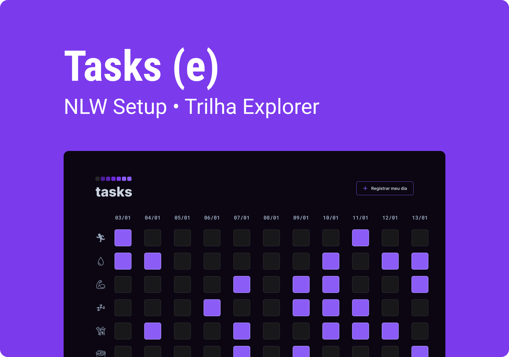

<h1 align="center"> Tasks (e) </h1>

Aplicativo Web desenvolvido durante o NLW, evento promovido pela Rocketseat para ensino de tecnologias WEB.  

  <a href="#-tecnologias">Tecnologias</a>&nbsp;&nbsp;&nbsp;|&nbsp;&nbsp;&nbsp;
  <a href="#-projeto">Projeto</a>&nbsp;&nbsp;&nbsp;|&nbsp;&nbsp;&nbsp;
  <a href="#-layout">Layout</a>&nbsp;&nbsp;&nbsp;|&nbsp;&nbsp;&nbsp;
  <a href="#-licença">Licença</a>

 

  

 

  

## 🤖 Tecnologias

Esse projeto foi desenvolvido com as seguintes tecnologias:

- HTML / CSS
- JavaScript
- Git / Github
- Figma

## 💻 Projeto

O Tasks é um app para ajudar a registrar seus hábitos e tarefas do dia-dia.

- [Visite o projeto online](https://fgsantoz.github.io/tasks-nlw)

## 📰 Layout

[Clique áqui](https://www.figma.com/file/CwvILzFSg7GLpvl4bG74CI/Tasks?t=MY2lXvvGKLRRIwp6-1) para ter acesso ao design do projeto. É necessário ter conta no [Figma](https://figma.com).

## ⚖ Licença

Esse projeto está sob a licença MIT.

---

Feito sob orientação da [Rocketseat](https://www.rocketseat.com.br/) :wave: [Participe de nossa comunidade no Discord!](https://discord.gg/rocketseat)
