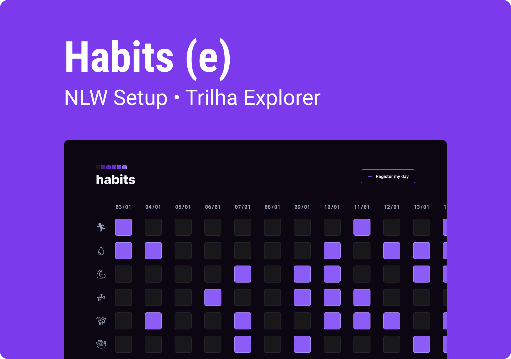

<h1 align="center"> Tasks (e) </h1>

Web application developed during NLW, an event promoted by Rocketseat for teaching web technologies.  

  <a href="tech">Technologies</a>&nbsp;&nbsp;&nbsp;|&nbsp;&nbsp;&nbsp;
  <a href="pjkt">Project</a>&nbsp;&nbsp;&nbsp;|&nbsp;&nbsp;&nbsp;
  <a href="ui">UI Design</a>&nbsp;&nbsp;&nbsp;|&nbsp;&nbsp;&nbsp;
  <a href="lcs">License</a>

 

  

 

  

<h2 id="tech">Technologies</h2>

This project was developed using the following technologies:

- HTML / CSS
- JavaScript
- Git / Github
- Figma

<h2 id="pjkt">TProject</h2>

Habits is an app to help you keep track of your daily habits and tasks.

- [Visit the project online](https://fgsantoz.github.io/habitsapp-nlw)

<h2 id="ui">UI Design</h2>

[Click here](https://www.figma.com/file/CwvILzFSg7GLpvl4bG74CI/Tasks?t=MY2lXvvGKLRRIwp6-1) to access the project design. A [Figma](https://figma.com) account is required.

<h2 id="lcs">License</h2>

This project is under the MIT license.

---

Made under the guidance of [Rocketseat](https://www.rocketseat.com.br/) :wave: [Join our community on Discord!](https://discord.gg/rocketseat)
